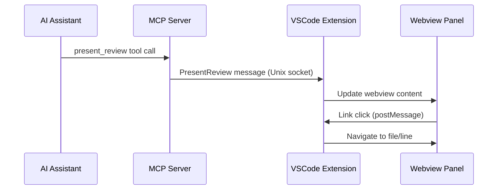

# Present Review

How AI assistants display code reviews in VSCode through the MCP server and extension.

## Message Flow

## Implementation Details

**MCP Server** (`server/src/server.rs`):
- Receives `present_review` tool call with markdown content
- Validates parameters using `PresentReviewParams` struct
- Forwards to VSCode extension via Unix socket IPC

**VSCode Extension** (`extension/src/reviewWebview.ts`):
- Receives message from MCP server
- Processes markdown with custom link renderer
- Updates webview panel with processed HTML

**Link Processing**:
- Converts `file.ts?searchTerm` → `dialectic:file.ts?regex=searchTerm`
- Converts `file.ts#L42` → `dialectic:file.ts?line=42`
- Handles disambiguation when search finds multiple matches

## Key Files

- `server/src/server.rs` - Tool handler and IPC forwarding
- `server/src/types.rs` - Parameter definitions
- `extension/src/reviewWebview.ts` - Webview management and link handling
- `extension/src/extension.ts` - Message routing from daemon client
