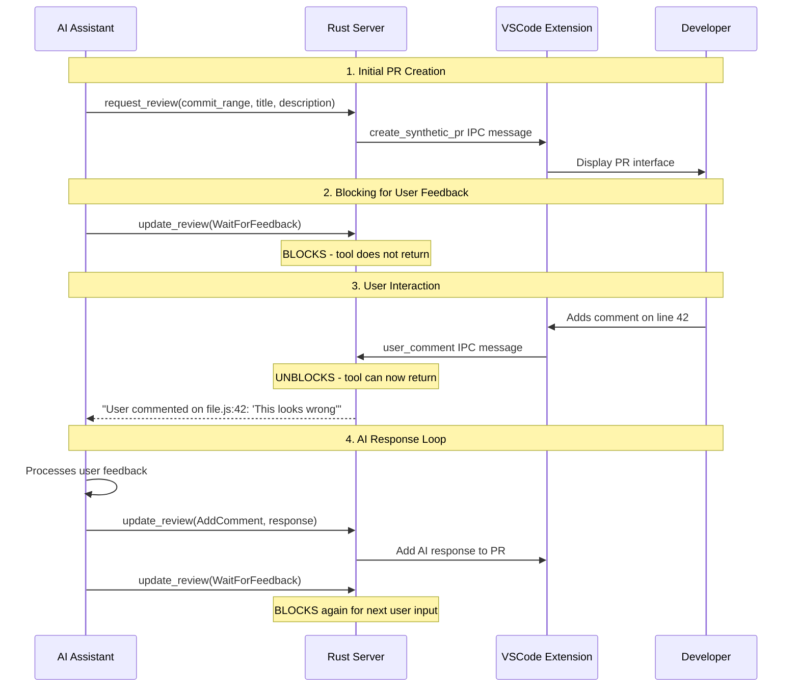
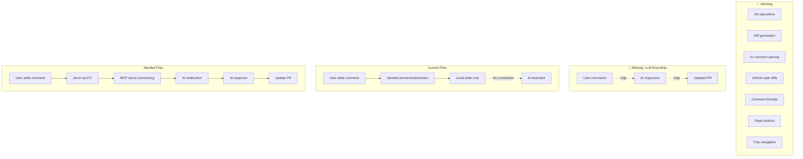
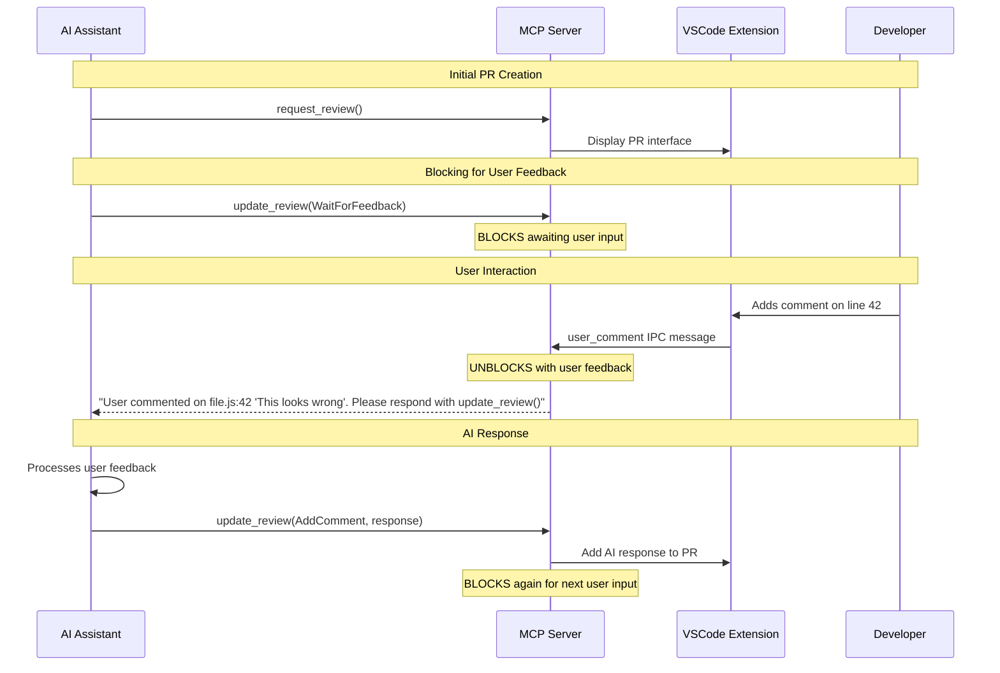

# Synthetic Pull Requests

Synthetic Pull Requests provide a GitHub-style code review interface for LLM-generated changes, enabling familiar PR workflows (approve/request changes) without requiring remote Git repositories.

## Architecture Overview

The Rust MCP server manages:

* Preparing the review by examining the git state and scraping notable comments
* Persisting the state of the review in a JSON file

The IDE extension manages:

* Visualizing diffs + comments
* Tree navigation
* Diff display
* IPC communication

## Roundtripping and Blocking

**The Challenge**: MCP servers have no way to asynchronously notify LLMs. Once an MCP tool returns, the server cannot "wake up" the AI assistant later when events occur.

**The Solution**: **Blocking MCP tools** that don't return until user interaction completes.



This creates a **natural conversation loop** where the AI assistant blocks until the user provides input, processes that feedback, responds, then blocks again waiting for the next user interaction.

## Core Workflow

1. **AI Implementation**: LLM writes/modifies files in local directory
2. **PR Creation**: AI calls `request_review(commit_range, title, description)`
3. **Diff Generation**: Server parses Git range, generates structured diffs
4. **AI Comment Extraction**: Server finds 💡❓TODO/FIXME markers in changed lines
5. **VSCode Display**: Extension shows GitHub-style PR interface with diffs and comments
6. **Blocking for Feedback**: AI calls `update_review(WaitForFeedback)` and blocks
7. **User Review**: Developer reviews using familiar PR patterns, adds comments
8. **IPC Unblocking**: User comments trigger IPC messages that unblock the MCP tool
9. **AI Response**: AI processes feedback, responds with `update_review(AddComment, response)`
10. **Loop**: AI blocks again with `update_review(WaitForFeedback)` for continuous interaction

## Component Details

### Rust MCP Server (`server/src/synthetic_pr/`)

**Git Service** (`git_service.rs`):
- Uses `git2` crate for repository operations
- Parses commit ranges: `HEAD`, `HEAD~2`, `abc123..def456`
- Generates structured diffs with file statistics and line-by-line hunks

**Comment Parser** (`comment_parser.rs`):
- Regex-based extraction: `💡 insight`, `❓ question`, `TODO:`, `FIXME:`
- **Only parses changed lines** (from diff hunks, not entire files)
- Associates comments with specific line numbers and file paths

**Review State** (`review_state.rs`):
- JSON serialization to `.socratic-shell-review.json`
- Tracks review status: Pending, Approved, ChangesRequested

**MCP Tools** (`mcp_tools.rs`):
- `request_review()`: Create new synthetic PR from Git commit range
- `update_review()`: Handle review actions, **blocks for user feedback**
- `get_review_status()`: Query current review state

### VSCode Extension (`extension/src/`)

**Synthetic PR Provider** (`syntheticPRProvider.ts`):
- Manages `CommentController` for GitHub-style commenting
- Handles comment thread creation and management
- **Key gap**: `handleCommentSubmission()` needs to send IPC messages for roundtrip

**Tree Provider** (`syntheticPRTreeProvider.ts`):
- GitHub-style file browser in Explorer sidebar
- Shows file changes with +/- statistics
- Click-to-diff navigation

**Diff Content Provider** (`syntheticFileProvider.ts`):
- `TextDocumentContentProvider` for `dialectic-diff:` URI scheme
- **Hunk reverse-application**: Reconstructs "before" state from current files + diff hunks
- Enables VSCode's native red/green diff highlighting

**Extension Main** (`extension.ts`):
- IPC communication via Unix socket
- Message routing: `create_synthetic_pr`, `update_synthetic_pr`
- Process discovery and daemon connection

## Current State & LLM Roundtrip Gap



## LLM Roundtrip Design: Blocking MCP Tool Pattern

**The Solution**: **Blocking MCP tool with IPC unblocking**



**Key Architecture Principles**:

1. **MCP Tools Block**: `request_review()` and `update_review(WaitForFeedback)` block until user provides input
2. **IPC Unblocks**: User comments in VSCode send IPC messages that unblock the MCP tool
3. **Structured Response**: MCP tool returns structured data about user feedback (file, line, content)
4. **AI Processes**: AI assistant processes feedback and calls `update_review()` with response
5. **Continuous Loop**: Each AI response blocks again, waiting for next user input

**Tool Behavior**:
- `update_review()` description: *"This tool is used to interact with the user through their IDE. Do not invoke it except when asked to do so by other tools within dialectic."*
- Only invoke when explicitly instructed by other Dialectic tools
- Always blocks awaiting user interaction

## File Structure

```
server/src/synthetic_pr/
├── mod.rs              # Module exports
├── git_service.rs      # Git operations with git2
├── comment_parser.rs   # AI comment extraction
├── review_state.rs     # JSON state persistence
└── mcp_tools.rs        # MCP tool implementations

extension/src/
├── syntheticPRProvider.ts     # CommentController management
├── syntheticPRTreeProvider.ts # File browser tree view
├── syntheticFileProvider.ts   # Diff content provider
└── extension.ts               # IPC and main logic
```

## Implementation Plan

### 1. Update MCP Tool Interface

**Current `update_review()` signature**:
```rust
pub enum UpdateReviewAction {
    WaitForFeedback,
    AddComment { comment: serde_json::Value },
    Approve,
    RequestChanges,
}
```

**Enhanced for blocking pattern**:
```rust
// Tool blocks until user provides feedback
// Returns structured user feedback data
pub struct UserFeedbackResponse {
    pub review_id: String,
    pub comment_id: String,
    pub file_path: String,
    pub line_number: u32,
    pub user_comment: String,
    pub context_lines: Vec<String>, // Surrounding code for context
}
```

### 2. IPC Message Extension

**New IPC message type**:
```typescript
interface UserCommentPayload {
    review_id: string;
    comment_id: string;
    file_path: string;
    line_number: number;
    comment_text: string;
    context_lines: string[];
}
```

### 3. Extension Changes

**Enhanced `handleCommentSubmission()`**:
```typescript
private handleCommentSubmission(reply: vscode.CommentReply): void {
    // Current: Add comment locally
    const newComment = { /* ... */ };
    reply.thread.comments = [...reply.thread.comments, newComment];
    
    // NEW: Send to MCP server via IPC
    this.sendUserComment({
        review_id: this.currentPR.review_id,
        comment_id: generateCommentId(),
        file_path: reply.thread.uri.fsPath,
        line_number: reply.thread.range.start.line + 1,
        comment_text: reply.text,
        context_lines: this.getContextLines(reply.thread.uri, reply.thread.range)
    });
}
```

### 4. Server Blocking Logic

**MCP tool implementation**:
```rust
pub async fn update_review(params: UpdateReviewParams) -> Result<UpdateReviewResponse> {
    match params.action {
        UpdateReviewAction::WaitForFeedback => {
            // Block until IPC message arrives
            let user_feedback = ipc_communicator.wait_for_user_comment().await?;
            
            Ok(UpdateReviewResponse {
                status: "user_feedback_received".to_string(),
                user_feedback: Some(user_feedback),
                message: Some(format!(
                    "User commented on {}:{} - '{}'. Please respond with update_review()",
                    user_feedback.file_path,
                    user_feedback.line_number,
                    user_feedback.user_comment
                ))
            })
        }
        // ... other actions
    }
}
```

This creates a **natural conversation loop** where:
1. AI blocks waiting for user input
2. User comments unblock the AI with structured feedback
3. AI processes and responds
4. Cycle repeats for continuous interaction
